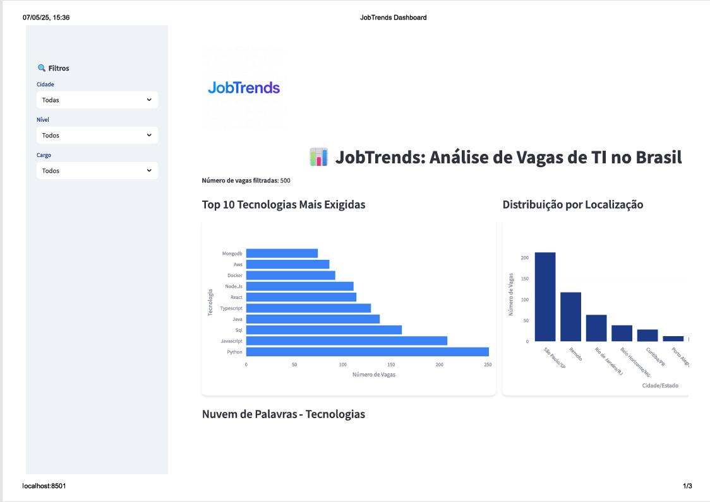
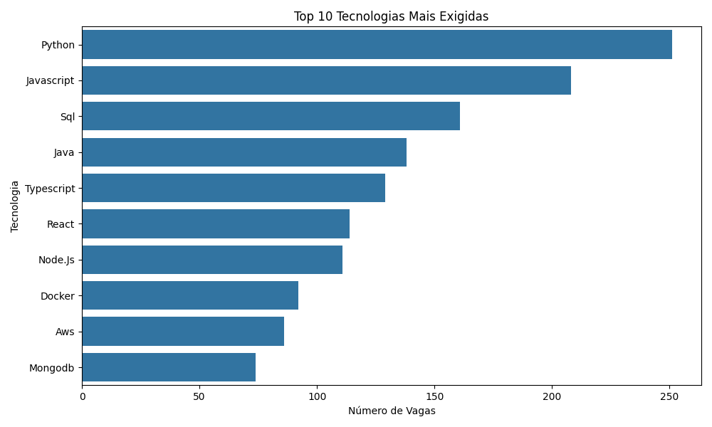
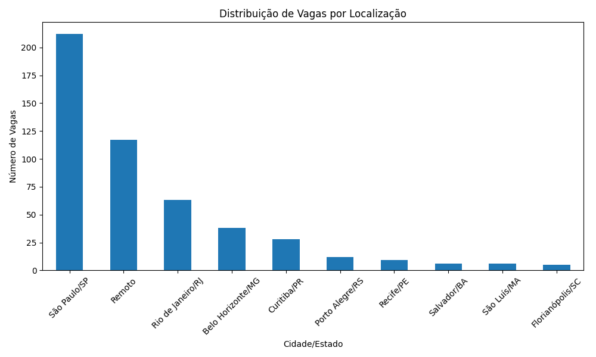
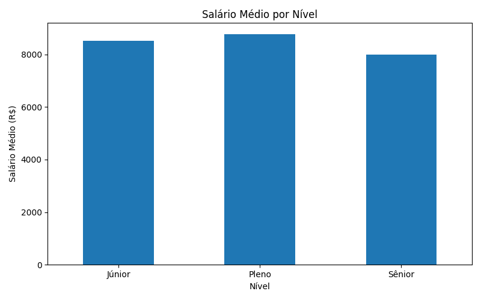

# JobTrends: Análise de Vagas de TI no Brasil


## 📊 Introdução

**JobTrends** é um projeto de análise de dados que explora o mercado de vagas de Tecnologia da Informação (TI) no Brasil. O objetivo é responder perguntas como:

- Quais são as tecnologias mais demandadas?
- Como os salários variam por nível (Júnior, Pleno, Sênior)?
- Quais benefícios são mais oferecidos?
- Como as vagas estão distribuídas por localização, incluindo cidades como São Luís/MA?

O projeto simula um conjunto de 500 vagas de TI, limpa e analisa os dados, e apresenta os resultados em um **dashboard interativo** construído com Streamlit, estilizado com uma interface moderna e a logo personalizada `JobsTrends.png`.

## 🚀 Funcionalidades

- **Simulação de Dados**: Geração de 500 vagas realistas com cargos, tecnologias, salários, benefícios e localizações (incluindo São Luís/MA).
- **Limpeza de Dados**: Tratamento de valores ausentes, padronização de localizações e remoção de duplicatas.
- **Análise Exploratória**: Gráficos para tecnologias mais exigidas, distribuição por localização, salários, níveis e benefícios.
- **Dashboard Interativo**: Interface web com filtros para cidade, nível e cargo, exibindo gráficos dinâmicos e uma nuvem de palavras.
- **Estilização**: Tema visual moderno com cores em tons de azul, gráficos em containers com sombra e logo personalizada.

## 📂 Estrutura do Projeto

O projeto é dividido em fases:

1. **Fase 2: Simulação de Dados** (`gerador_de_dados.py`):
   - Gera um CSV com 500 vagas simuladas, incluindo localizações como São Luís/MA.
2. **Fase 3: Limpeza de Dados** (`filtro.py`):
   - Remove duplicatas, preenche salários ausentes e padroniza colunas.
3. **Fase 4: Análise Exploratória** (`analise.py`):
   - Cria gráficos para análise (ex.: Top 10 Tecnologias, Salário Médio por Nível).
4. **Fase 5: Dashboard** (`dashboard.py`):
   - Interface interativa com filtros e gráficos estilizados, incluindo a logo `JobsTrends.png`.
5. **Fase 6: Documentação** (este README):
   - Instruções para executar e entender o projeto.

## 🛠 Pré-requisitos

- **Python**: 3.8 ou superior.
- **Bibliotecas Python**:
  ```bash
  pip install pandas numpy faker matplotlib seaborn wordcloud streamlit plotly
  ```
- **Arquivos necessários**:
  - `vagas_ti_limpo_realistas.csv` (gerado na Fase 3).
  - `JobsTrends.png` (logo no diretório do projeto).
- **Sistema operacional**: Windows, macOS ou Linux.

## 📖 Instruções de Uso

1. **Clone o repositório** (ou copie os arquivos para um diretório local):
   ```bash
   git clone <URL_DO_REPOSITORIO>
   cd JobTrends
   ```

2. **Instale as dependências**:
   ```bash
   pip install pandas numpy faker matplotlib seaborn wordcloud streamlit plotly
   ```

3. **Execute as fases do projeto**:
   - **Fase 2: Gerar dados** (opcional, se o CSV não existir):
     ```bash
     python gerador_de_dados.py
     ```
     Gera `vagas_ti_simuladas_realistas.csv`.
   - **Fase 3: Limpar dados**:
     ```bash
     python filtro.py
     ```
     Gera `vagas_ti_limpo_realistas.csv`.
   - **Fase 4: Análise exploratória** (opcional, para gráficos estáticos):
     ```bash
     python analise.py
     ```
     Gera imagens como `top_tecnologias_realistas.png`.
   - **Fase 5: Executar o dashboard**:
     ```bash
     streamlit run dashboard.py
     ```
     Abre o dashboard em `http://localhost:8501`.

4. **Interaja com o dashboard**:
   - Use os filtros (Cidade, Nível, Cargo) para explorar os dados.
   - Selecione `São Luís/MA` para analisar vagas específicas dessa cidade.
   - Veja os gráficos interativos e a nuvem de palavras.

## 📈 Resultados

Abaixo estão alguns exemplos de visualizações geradas pelo projeto:

### Dashboard Interativo

*Dashboard com filtros e gráficos estilizados, incluindo a logo `JobsTrends.png`.*

### Top 10 Tecnologias

*Gráfico mostrando as tecnologias mais exigidas nas vagas.*

### Distribuição por Localização

*Distribuição de vagas por cidade, incluindo São Luís/MA.*

### Salário Médio por Nível

*Salários médios para Júnior, Pleno e Sênior.*


## 🤝 Contribuição

Contribuições são bem-vindas! Para contribuir:
1. Faça um fork do repositório.
2. Crie uma branch para sua feature (`git checkout -b feature/nova-funcionalidade`).
3. Commit suas mudanças (`git commit -m 'Adiciona nova funcionalidade'`).
4. Push para a branch (`git push origin feature/nova-funcionalidade`).
5. Abra um Pull Request.

## 📜 Licença

Este projeto está licenciado sob a [Licença MIT](LICENSE).

## 📬 Contato

- **Autor**: [Nilo Di Armanni]
- **LinkedIn**: [www.linkedin.com/in/nilo-di-armanni]
- **E-mail**: [nilodiarmanniff@gmail.com]

---

**JobTrends** foi criado para demonstrar habilidades em ciência de dados, visualização e desenvolvimento de dashboards. Explore o mercado de TI brasileiro e descubra tendências valiosas!
